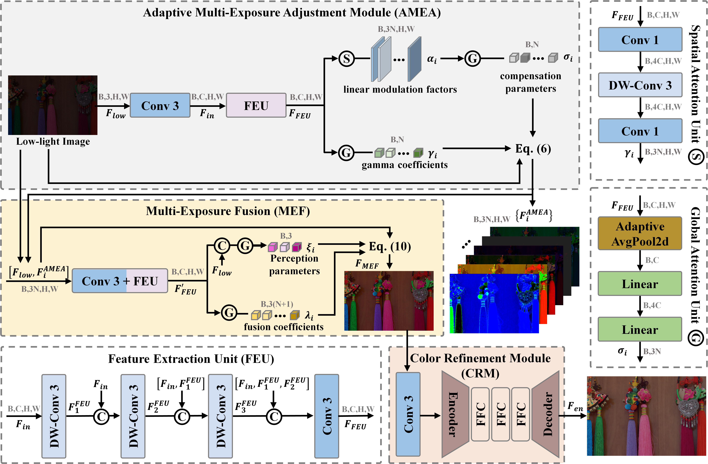

# MEGF-Net: Low-Light Image Enhancement via Adaptive Multi-Exposure Adjustment and Fusion
this is the official code for the paper "MEGF-Net: Low-Light Image Enhancement via Adaptive Multi-Exposure Adjustment and Fusion"

## Datasets
You can use the following links to download the datasets:

LOL-v1 [Baidu Disk](https://pan.baidu.com/s/1ZAC9TWR-YeuLIkWs3L7z4g?pwd=cyh2) (code: `cyh2`), [Google Drive](https://drive.google.com/file/d/1L-kqSQyrmMueBh_ziWoPFhfsAh50h20H/view?usp=sharing)

LOL-v2 [Baidu Disk](https://pan.baidu.com/s/1X4HykuVL_1WyB3LWJJhBQg?pwd=cyh2) (code: `cyh2`), [Google Drive](https://drive.google.com/file/d/1Ou9EljYZW8o5dbDCf9R34FS8Pd8kEp2U/view?usp=sharing)

LSRW [Baidu Disk](https://pan.baidu.com/s/1XHWQAS0ZNrnCyZ-bq7MKvA) (code: `wmrr`)

## Network Architecture


## Quantitative results
Results on LOLv2-Synthetic


## Get Started
### Test
You can directly test the pre-trained model,
Modify line 21 to specify the input enhanced image path
Modify line 22 to specify the model path
Modify line 23 to specify the output path for saving enhanced images
```bash
python test_ours_other.py
```

### Train
Modify lines 173 and 174 to specify the dataset used for training and the dataset used for evaluation during training, respectively. The dataset file path should be set to:
```bash
LOLv1
   ---train
      ---High
      ---Low
   ---Test
      ---High
      ---Low

python train.py
```

## Contact
If you have any questions, please contact 3220245159@bit.edu.cn

---


## Reference Repositories
This implementation is based on  inspired by:
- BSMamba: https://github.com/bywlzts/BSMamba
- CodeEnhance: https://github.com/csxuwu/CodeEnhance
---
